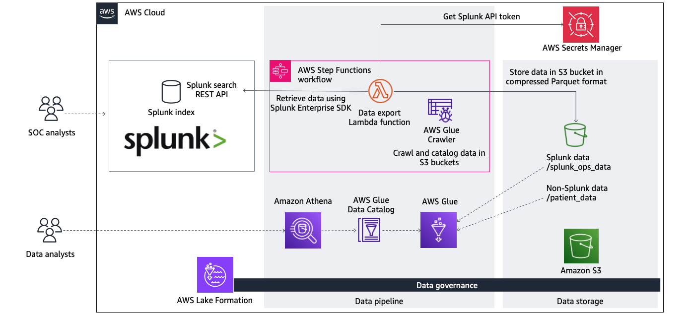

# harness-the-power-of-ai-and-ml-using-splunk-and-amazon-sagemaker-canvas


## Overview ##

### AWS Blog post ###

TODO: Replace with blog post link.

### Introduction ###

The blog post above explores how Amazon SageMaker Canvas, a no-code ML development service, can be used in conjunction with data collected in Splunk to drive actionable insights. The adaptable approach detailed in it starts with an automated data engineering pipeline to make data stored in Splunk available to a wide range of personas, including business intelligence (BI) analysts, data scientists and ML practitioners, through a structured query language (SQL) interface. This is achieved by using the pipeline to transfer data from a Splunk index into an Amazon S3 bucket where it will be catalogued. 

This `aws-samples` repository houses an [AWS Serverless Application Model (AWS SAM)](https://aws.amazon.com/serverless/sam/) template and related Python code that demonstrates this pipeline in action.



## Walkthrough ##

### Prerequisites ###

For this walkthrough, you will need the following prerequisites in place:

* An AWS account
* [AWS Identity and Access Management (IAM)](https://aws.amazon.com/iam/) permissions to deploy the AWS resources using [AWS SAM](https://aws.amazon.com/serverless/sam/)
* Latest version of [AWS SAM Command Line Interface (CLI)](https://docs.aws.amazon.com/serverless-application-model/latest/developerguide/install-sam-cli.html) installed locally
* Local installation of [Python 3.11](https://www.python.org/downloads/release/python-3110/) and [pip](https://pypi.org/project/pip/)
* The Lambda function used by this solution uses a container image which is built locally at the time of deployment. [Install Docker](https://docs.aws.amazon.com/serverless-application-model/latest/developerguide/install-docker.html) on your operating system if it is not already installed and running.

#### Storing the Splunk bearer token in AWS Secrets Manager ####

[AWS Secrets Manager](https://aws.amazon.com/secrets-manager/) is used to store the Splunk bearer token. This is used by the AWS Lambda function when accessing Splunk's search REST API endpoint. Follow Splunk's [Create authentication tokens](https://docs.splunk.com/Documentation/Splunk/latest/Security/CreateAuthTokens) document for steps to create the bearer authentication token. Once you have the token generated, follow the steps below to store it using Secrets Manager:

1. In the **AWS console**, navigate to **AWS Secrets Manager** and select **Store a new secret** to create a new secret.

2. Select **Other type of secret** and enter the following details as **key**/**value** pairs. 

| Key | Value                                                                                                                    |
| --- |--------------------------------------------------------------------------------------------------------------------------|
| `SplunkBearerToken` | Splunk bearer token retrieved from Splunk. This is used when authenticating against the Splunk search REST API endpoint. |
| `SplunkDeploymentName` | Name of your Splunk deployment. This is used when constructing the search REST API endpoint URL for Splunk Cloud.        |
| `SplunkIndexName` | Name of the Splunk index used to verify connectivity.                                                                    |

3. Enter `SplunkDeployment` as the **Secret name**. Select **Next**. Complete the remaining configuration of the new secret with default settings.

#### Review the configuration file ####

The data that is exported from Splunk to S3 is controlled by the `configuration.json` [file](splunk-data-export/configuration.json). This file includes the Splunk [search processing language](https://docs.splunk.com/Documentation/Splunk/latest/SearchTutorial/Usethesearchlanguage) query used to retrieve the results.

> **Important**: The file currently contains default values. Update the file as required before deployment.

##### Update the configuration file #####

`mysource`, `myindex` and `mysourcetype` values should be replaced as required by your SPL query. We recommend that you test the SPL query in Splunk with limited data first to ensure that it is returning expected results.

`mypath` should be replaced with the name of the sub-folder in which the exported data is stored. The S3 bucket is auto-generated by the AWS SAM template deployment, and the top-level folder is determined later via the `splunkDataExportTopLevelPath` CloudFormation parameter during deployment time.

`myid` should be replaced with the field that you wish to use as the partition key (for example, `userid`). Some analytics tooling expect data stored in the field used for constructing the partitioned folder structure to also be duplicated in a non-partitioned column. `myidcopy` should be replaced with the name of a new column that you create which duplicates this data (e.g. `userid_copy`).

```
{
  "searches":
  [
    {
      "spl": {
        "search_query": "search source=mysource index=myindex sourcetype=mysourcetype | table *",
        "search_export": {
          "earliest_time": "0",
          "latest_time": "now",
          "enable_lookups": "true",
          "parse_only": "false",
          "count": "50000",
          "output_mode": "json"
        }
      },
      "s3": {
        "path": "mypath/",
        "partition_cols": ["myid"],
        "partition_cols_duplicate": ["myid_copy"],
        "engine": "pyarrow",
        "compression": "snappy"
      }
    }
  ]
}
```

Visit the [Splunk Developer Tools site](https://dev.splunk.com/enterprise/docs/devtools/python/sdk-python/examplespython/) for more information about the Splunk Enterprise SDK for Python.

### Deploying the solution ###

Before starting, confirm that the latest version of the AWS SAM CLI is installed by running `sam --version`.

> **Note:** The AWS SAM CLI requires appropriate permissions to provision resources in the chosen AWS account. Ensure that [access key and secret access keys](https://docs.aws.amazon.com/serverless-application-model/latest/developerguide/prerequisites.html) have been created using IAM, and that `aws configure` has been used to register them locally on your machine.

1. To download all required files to your local machine, run the following command.

```
git clone https://github.com/aws-samples/harness-the-power-of-ai-and-ml-using-splunk-and-amazon-sagemaker-canvas.git
```

> **Note:** If you are unable to use the `git` command, simply download the source code from **Code** > **Download source code**. Unzip the zip file in your chosen directory.

2. Navigate into the `harness-the-power-of-ai-and-ml-using-splunk-and-amazon-sagemaker-canvas` folder.

```
cd harness-the-power-of-ai-and-ml-using-splunk-and-amazon-sagemaker-canvas
```

3. Build the SAM application. 

```
sam build
```

4. Confirm that the `Build Succeeded` message is displayed.


5. Deploy the application.

```
sam deploy --guided
```

6. When prompted, enter the unique details chosen for your CloudFormation stack. In this example, we have chosen the CloudFormation stack name `splunkDataExport` and kept the remainder of the options as defaults. 

```
Stack Name [sam-app]: splunkDataExport
AWS Region [eu-west-1]: us-east-1
Parameter splunkSecretsManagerSecret [SplunkDeployment]: 
Parameter splunkDataExportConfigurationFile [configuration.json]:
Parameter splunkDataExportTopLevelPath [splunk-data]: 
```


7. Confirm that the `Successfully created/updated stack` message is shown. Deployment will take approximately 5 minutes.


8. You are now ready to test the solution.

### Testing the solution ###

The data export pipeline has been fully provisioned through the deployed CloudFormation stack. To run it, navigate to the **Amazon Step Functions** console. Select the state machine, and select **Start execution**. After a few minutes, the entire pipeline will run. This will create and populate tables in AWS Glue.


The automation handles:

- API calls to Splunk search REST API
- Conversion of retrieved data into [Apache Parquet format](https://en.wikipedia.org/wiki/Apache_Parquet) with compression and partitioning enabled, and storage in S3 bucket
- Execution of AWS Glue crawler to catalog files stored in S3 as tables in AWS Glue Data Catalog

Progress can be monitored using the **Graph view** of the state machine execution.


Once complete, data can now be queried using Amazon Athena directly, or with other tools that integrate with Athena, such as Amazon SageMaker and Amazon QuickSight.


#### Additional data ####

If you want additional data to be crawled alongside the data exported from Splunk, create another folder inside the top-level folder, and upload your file to it (e.g. a CSV file). This data will be automatically crawled during the next execution of the Step Functions state machine and will appear as an additional table in the AWS Glue Data Catalog.

- Top-level folder (e.g. `splunk-data/`) - set in `splunkDataExportTopLevelPath` CloudFormation parameter
  - Data export path(s) (e.g. `mypath/`) - set in `configuration.json`
  - Additional data files (e.g. `myadditionalpath/`) - manually created (if required)

### Cleaning up ###

To avoid incurring future charges, delete the CloudFormation stacks that have been provisioned in the AWS account. This can be achieved using:

```
sam delete
```

You will be required to empty the S3 bucket before the template can be deleted. The S3 bucket used for the data can be found in the CloudFormation output `splunkDataExportS3BucketName`.
